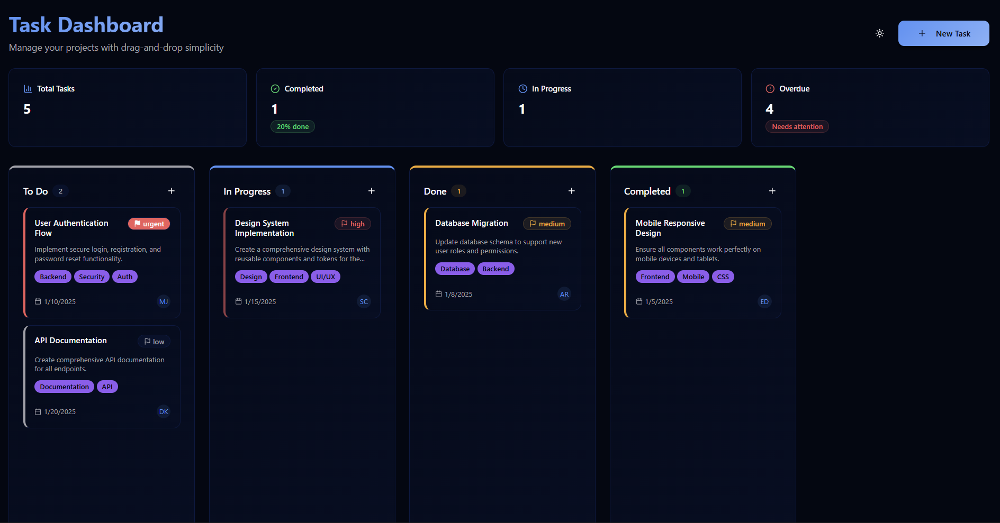

# Zest Team Tasks

<p align="center">
  
</p>

A modern, responsive task management application built with React and TypeScript. This application provides a Kanban-style board for organizing and tracking team tasks with drag-and-drop functionality, task prioritization, and comprehensive project analytics.

## Features

- **Kanban Board**: Visual task management with drag-and-drop functionality across four columns (To Do, In Progress, Done, Completed)
- **Task Management**: Create, edit, and delete tasks with detailed information including:
  - Title and description
  - Priority levels (Low, Medium, High, Urgent)
  - Assignee tracking
  - Due dates
  - Custom tags and categories
- **Project Analytics**: Real-time dashboard showing:
  - Total tasks count
  - Completion percentage
  - Tasks in progress
  - Overdue task alerts
- **Dark/Light Theme**: Toggle between themes for better user experience
- **Responsive Design**: Works seamlessly on desktop, tablet, and mobile devices
- **Modern UI**: Built with shadcn/ui components for a polished, professional look

## Getting Started

To work with this project locally, you can clone this repo and push changes.

The only requirement is having Node.js & npm installed - [install with nvm](https://github.com/nvm-sh/nvm#installing-and-updating)

Follow these steps:

```sh
# Step 1: Clone the repository
git clone https://github.com/kiganyamburu/zest-team-tasks.git

# Step 2: Navigate to the project directory
cd zest-team-tasks

# Step 3: Install the necessary dependencies
npm install

# Step 4: Start the development server
npm run dev
```

The application will be available at `http://localhost:5173`

## Available Scripts

- `npm run dev` - Start the development server
- `npm run build` - Build the project for production
- `npm run preview` - Preview the production build locally
- `npm run lint` - Run ESLint to check for code quality issues

## Project Structure

```
src/
├── components/          # React components
│   ├── ui/             # shadcn/ui components
│   ├── KanbanColumn.tsx    # Kanban board column component
│   ├── TaskCard.tsx        # Individual task card component
│   ├── TaskDashboard.tsx   # Main dashboard component
│   ├── TaskForm.tsx        # Task creation/editing form
│   └── ThemeToggle.tsx     # Dark/light theme toggle
├── hooks/              # Custom React hooks
├── lib/                # Utility functions
├── pages/              # Page components
└── App.tsx             # Main application component
```

## Technologies

This project is built with:

- **Vite** - Fast build tool and development server
- **React 18** - Modern React with hooks and concurrent features
- **TypeScript** - Type-safe JavaScript for better development experience
- **shadcn/ui** - High-quality, accessible React components
- **Tailwind CSS** - Utility-first CSS framework for rapid styling
- **Radix UI** - Unstyled, accessible UI primitives
- **Lucide React** - Beautiful, customizable icons
- **React Query** - Server state management and caching
- **React Hook Form** - Performant forms with easy validation

## Usage

1. **Creating Tasks**: Click the "New Task" button to create a new task with title, description, priority, assignee, due date, and tags
2. **Managing Tasks**: Drag and drop tasks between columns to update their status
3. **Editing Tasks**: Click on any task card to edit its details
4. **Tracking Progress**: Use the analytics cards at the top to monitor project progress
5. **Theme Toggle**: Use the theme toggle button to switch between light and dark modes

## Contributing

1. Fork the repository
2. Create a feature branch (`git checkout -b feature/amazing-feature`)
3. Commit your changes (`git commit -m 'Add some amazing feature'`)
4. Push to the branch (`git push origin feature/amazing-feature`)
5. Open a Pull Request

## Development

**Edit a file directly in GitHub**

- Navigate to the desired file(s).
- Click the "Edit" button (pencil icon) at the top right of the file view.
- Make your changes and commit the changes.

**Use GitHub Codespaces**

- Navigate to the main page of your repository.
- Click on the "Code" button (green button) near the top right.
- Select the "Codespaces" tab.
- Click on "New codespace" to launch a new Codespace environment.
- Edit files directly within the Codespace and commit and push your changes once you're done.

## Technologies

This project is built with:

- Vite
- TypeScript
- React
- shadcn-ui
- Tailwind CSS
